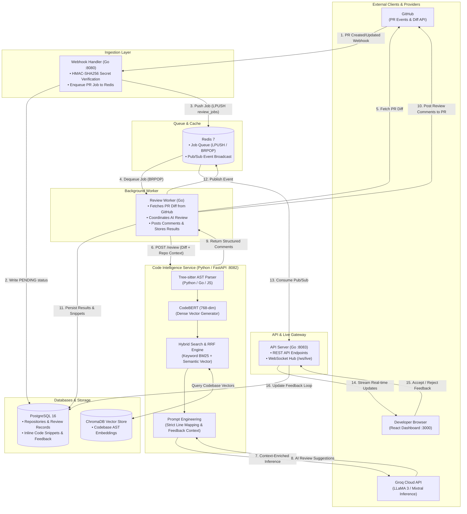

# CodeSense — AI-Powered Code Review & Codebase Intelligence Platform

CodeSense is an enterprise-grade, event-driven platform that intercepts GitHub Pull Requests, generates context-aware AI reviews using Retrieval-Augmented Generation (RAG) over your codebase's vector embeddings, and learns from developer feedback over time.

---

## 📚 Documentation & Technical Guides

This repository includes three comprehensive, publication-grade guides:

| Document | Description | Format |
| :--- | :--- | :--- |
| 📘 **[Technical Masterclass & Interview Defense Guide](./CodeSense_Complete_Technical_Masterclass_and_Interview_Defense_Guide.pdf)** | 29-page exhaustive engineering bible covering end-to-end architecture, mathematical proofs, RRF formulas, BERT anisotropy calibration, Devil's Advocate defenses, and 50 interview Q&As. | PDF |
| 🚀 **[Beginner's Visual Guide to LLMs & RAG](./CodeSense_Beginners_Visual_Guide_to_LLMs_and_RAG.pdf)** | 9-page illustrated conceptual companion explaining LLMs, RAG, ASTs, and vector embeddings using intuitive analogies and diagrams. | PDF |
| 🎯 **[Resume Preparation & Bullet Defense Guide](./Resume%20Prep%20CodeSense.pdf)** | Complete phrase-by-phrase technical deconstructions, mental models, stopwatch latency breakdowns, and verbal interview scripts for resume bullets. | PDF |

---

## Table of Contents

- [Documentation & Technical Guides](#-documentation--technical-guides)
- [Overview](#overview)
- [Architecture](#architecture)
- [Features](#features)
- [Tech Stack](#tech-stack)
- [Quick Start](#quick-start)
- [Project Structure](#project-structure)
- [Database Schema](#database-schema)
- [API Reference](#api-reference)
- [Engineering Decisions](#engineering-decisions)
- [License](#license)

---

## Overview

**The Problem**

Code reviews are slow. Developers wait hours — sometimes days — for feedback on pull requests. Generic AI tools produce surface-level suggestions because they lack context about a specific codebase: its patterns, conventions, and architectural decisions.

**The Solution**

CodeSense intercepts every pull request the moment it is created, analyzes it against your codebase's indexed AST and vector embeddings, and posts context-aware review comments to GitHub within 60 seconds. It retrieves similar functions from your repository, compares patterns, and improves over time through developer feedback.

---

## Architecture



**Data Flow**

1. **Intercept** — A GitHub webhook fires on PR creation. The Go Webhook Handler validates the `X-Hub-Signature-256` header against the repository's stored secret, writes a `PENDING` review to PostgreSQL, and pushes a job to Redis.

2. **Process** — The Review Worker dequeues the job, fetches the PR diff from GitHub, and forwards it to the Python Code Intelligence service. The diff is parsed into an AST using tree-sitter, and code chunks are embedded into ChromaDB using CodeBERT.

3. **Analyze** — The AI engine performs hybrid retrieval (keyword + semantic vector search) to find similar patterns in the indexed codebase, builds a context-rich prompt with the retrieved functions, and calls the Groq LLM with strict line-number mapping to prevent hallucination.

4. **Deliver** — Review comments — with severity, code snippets, and line references — are posted directly to the GitHub PR and stored in PostgreSQL. The React dashboard receives real-time updates via WebSocket and Redis Pub/Sub.

5. **Learn** — Developers accept or reject AI suggestions through the dashboard with full inline code context. Feedback is stored and injected into future review prompts, forming a reinforcement loop that improves review quality over time.

---

## Features

**Automated Code Review**

- Event-driven pipeline: PR created → webhook → queue → AI review → GitHub comments, fully asynchronous
- Context-aware reviews that reference similar functions already in your codebase
- Per-repository custom instructions (coding standards, focus areas, persona)
- Anti-hallucination prompt engineering with strict absolute line-number mapping to real diff content

**Codebase Intelligence (RAG)**

- AST parsing via tree-sitter across Python, Go, and JavaScript with complexity estimates
- 768-dimensional CodeBERT embeddings stored in ChromaDB
- Hybrid search using Reciprocal Rank Fusion to merge keyword precision with semantic vector recall
- Natural language Q&A over your codebase with function references and confidence scores
- One-click architecture summaries generated from indexed function metadata

**Feedback Loop**

- Each AI comment displays the surrounding code snippet so developers can make informed accept/reject decisions
- Accepted and rejected patterns are injected into future prompts, reducing noise over time
- Acceptance rate tracking to measure whether review quality is improving

**Analytics Dashboard**

- Acceptance rate trend chart over time
- Severity distribution across error, warning, and info levels
- Top issue categories (security, error handling, naming conventions)
- Review volume tracking across repositories

**AST Explorer**

- Collapsible file tree for browsing indexed repository structure
- Function-level detail including parameters, line ranges, and complexity estimates
- Vector similarity search: select a function, find its nearest neighbors with similarity scores

---

## Tech Stack

| Layer | Technology | Purpose |
|:------|:-----------|:--------|
| Webhook Handler | Go, Chi | GitHub event interception, HMAC validation, Redis enqueue |
| Review Worker | Go | Diff fetching, GitHub API integration, job orchestration |
| API Server | Go, Chi | REST API, WebSocket hub, JWT middleware |
| Code Intelligence | Python, FastAPI | AST parsing, embeddings, LLM orchestration, hybrid search |
| LLM | Groq API (LLaMA 3 / Mixtral) | Code review generation and RAG responses |
| AST Parser | tree-sitter | Multi-language function extraction |
| Embeddings | CodeBERT (microsoft/codebert-base) | 768-dimensional code vectors |
| Vector Store | ChromaDB | Similarity search over code embeddings |
| Database | PostgreSQL 16 | Reviews, feedback, repository configuration |
| Queue & Pub/Sub | Redis 7 | Job queue and real-time event broadcasting |
| Frontend | React 18, Vite, React Router | Single-page dashboard |
| Syntax Highlighting | react-syntax-highlighter | Language-aware code display in the UI |
| Deployment | Docker Compose | Single-command multi-service orchestration |

---

## Quick Start

### Prerequisites

- [Docker](https://docker.com) and Docker Compose
- [GitHub Personal Access Token](https://github.com/settings/tokens) with `repo` scope
- [Groq API Key](https://console.groq.com) (free tier available)
- [ngrok](https://ngrok.com) or [localtunnel](https://localtunnel.me) for webhook routing

### Setup

```bash
# 1. Clone the repository
git clone https://github.com/Darshan0403/ai-code-review.git
cd ai-code-review

# 2. Configure environment variables
cp .env.example .env
# Edit .env with your GitHub PAT, Groq API key, and admin credentials

# 3. Launch the entire platform
docker-compose up --build

# 4. Expose the webhook handler to the internet
ngrok http 8080
```

### Running Your First Review

1. Open `http://localhost:3000` and log in with your admin credentials.
2. Register a repository through the dashboard. Use the ngrok URL as the webhook endpoint.
3. Create a Pull Request on the registered repository.
4. The dashboard will display real-time progress via WebSocket as the review runs.
5. View the AI's comments on both the GitHub PR and the CodeSense dashboard.

### Rebuilding Without Losing Data

```bash
# Rebuild services only — PostgreSQL and ChromaDB volumes are preserved
docker-compose up --build

# Full teardown and rebuild while preserving data volumes
docker-compose down && docker-compose up --build

# Reset all data including volumes (destructive)
docker-compose down -v
```

---

## Project Structure

```
void/
├── docker-compose.yml              # Multi-service orchestration
├── init.sql                        # PostgreSQL schema (4 tables)
├── .env.example                    # Environment variable template
│
├── services/
│   ├── webhook-handler/            # Go — GitHub event interceptor
│   │   ├── handler/webhook.go      #   HMAC validation and event parsing
│   │   └── queue/redis.go          #   Redis job enqueue
│   │
│   ├── review-worker/              # Go — Async job processor
│   │   ├── worker/worker.go        #   Job loop and orchestration
│   │   ├── github/client.go        #   Diff fetching and comment posting
│   │   └── parser/diff.go          #   Unified diff parser
│   │
│   ├── api-server/                 # Go — REST API and WebSocket
│   │   ├── handlers/               #   Reviews, repos, analytics, feedback
│   │   ├── middleware/cors.go      #   CORS configuration
│   │   └── ws/hub.go               #   WebSocket connection manager
│   │
│   └── code-intelligence/          # Python — AI and ML services
│       ├── services/
│       │   ├── ast_parser.py       #   tree-sitter multi-language parsing
│       │   ├── embedder.py         #   CodeBERT embedding generation
│       │   ├── llm.py              #   Groq LLM client
│       │   └── vector_store.py     #   ChromaDB operations
│       ├── search/
│       │   ├── keyword_search.py   #   Identifier extraction and scoring
│       │   ├── semantic_search.py  #   HyDE and vector similarity
│       │   └── hybrid_ranker.py    #   Reciprocal Rank Fusion
│       └── routers/
│           ├── review.py           #   POST /review — AI code review
│           ├── explain.py          #   POST /explain — RAG Q&A
│           ├── index.py            #   POST /index — Codebase indexing
│           └── search.py           #   POST /search — Similarity search
│
└── frontend/                       # React dashboard
    └── src/
        ├── components/             #   Sidebar, cards, markdown renderer
        └── pages/                  #   Dashboard, Reviews, Explorer, Assistant
```

---

## Database Schema

**repositories**

| Column | Type | Notes |
|:-------|:-----|:------|
| id | uuid | Primary key |
| github_full_name | varchar | Unique |
| webhook_secret | varchar | Per-repo HMAC secret |
| custom_instructions | text | Optional per-repo AI instructions |
| config | jsonb | Additional configuration |
| is_paused | boolean | Pause reviews without removing repo |
| indexed_at | timestamptz | Last codebase index timestamp |

**pull_request_reviews**

| Column | Type | Notes |
|:-------|:-----|:------|
| id | uuid | Primary key |
| repo_full_name | varchar | |
| pr_number | int | |
| status | varchar | PENDING, PROCESSING, COMPLETE, FAILED |
| total_comments | int | |
| processing_time_ms | int | |
| user_read_status | varchar | |
| created_at | timestamptz | |

**review_comments**

| Column | Type | Notes |
|:-------|:-----|:------|
| id | uuid | Primary key |
| review_id | uuid | Foreign key → pull_request_reviews |
| file_path | varchar | |
| line_number | int | |
| severity | varchar | error, warning, info |
| comment_text | text | |
| code_snippet | text | Captured at review time |
| category | varchar | security, error-handling, naming, etc. |
| feedback_status | varchar | pending, accepted, rejected |

**review_feedback**

| Column | Type | Notes |
|:-------|:-----|:------|
| id | uuid | Primary key |
| review_comment_id | uuid | Foreign key → review_comments |
| feedback_type | varchar | accepted, rejected |
| created_at | timestamptz | |

---

## API Reference

### Public Endpoints

No authentication required.

| Method | Endpoint | Description |
|:-------|:---------|:------------|
| GET | `/api/v1/reviews` | Paginated list of all reviews |
| GET | `/api/v1/reviews/:id` | Review detail with comments and code snippets |
| GET | `/api/v1/repos` | List monitored repositories |
| GET | `/api/v1/analytics/dashboard` | Summary statistics (totals, acceptance rate, severity) |
| GET | `/api/v1/analytics/trends` | Time-series data (reviews per day, acceptance per day) |
| GET | `/api/v1/analytics/top-issues` | Most common issue categories |
| WS | `/ws/live` | Real-time review progress stream |

### Admin Endpoints

JWT authentication required.

| Method | Endpoint | Description |
|:-------|:---------|:------------|
| POST | `/api/v1/repos` | Register a new repository |
| DELETE | `/api/v1/repos/:id` | Remove a repository |
| POST | `/api/v1/feedback` | Submit accept or reject on a comment |

---

## Engineering Decisions

| Decision | Rationale |
|:---------|:----------|
| Go for HTTP services, Python for AI | Go handles high-concurrency webhook ingestion and API serving with minimal overhead. Python provides access to the ML ecosystem (tree-sitter, transformers, ChromaDB) without reimplementing existing libraries. |
| Redis as both queue and Pub/Sub | A single infrastructure component serves dual purpose: job queue for review processing and Pub/Sub channel for real-time WebSocket broadcasting. |
| Hybrid search (keyword + semantic) | Pure vector search misses exact function name matches. Reciprocal Rank Fusion combines keyword precision with semantic recall to eliminate retrieval blind spots. |
| Per-repository webhook secrets | Each repository validates against its own HMAC secret stored in the database, enabling multi-tenant webhook handling without shared credentials. |
| Code snippets stored at review time | The Review Worker captures surrounding code lines during diff processing so the frontend can display inline context without re-fetching from GitHub. |
| Feedback-informed prompt injection | Rejected suggestions are excluded from future prompt context; accepted patterns are reinforced. This creates a measurable improvement loop in review acceptance rates over time. |

---

## License

Distributed under the MIT License. See [`LICENSE`](./LICENSE) for more details.
